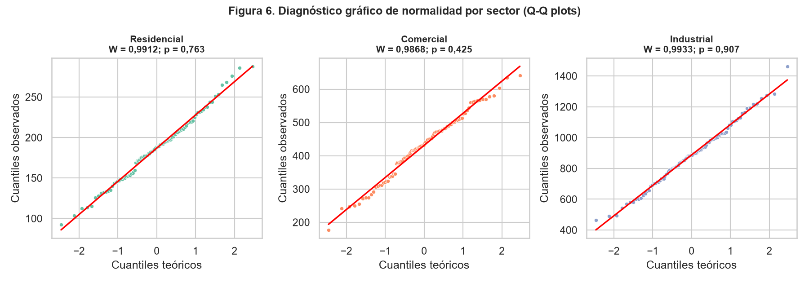
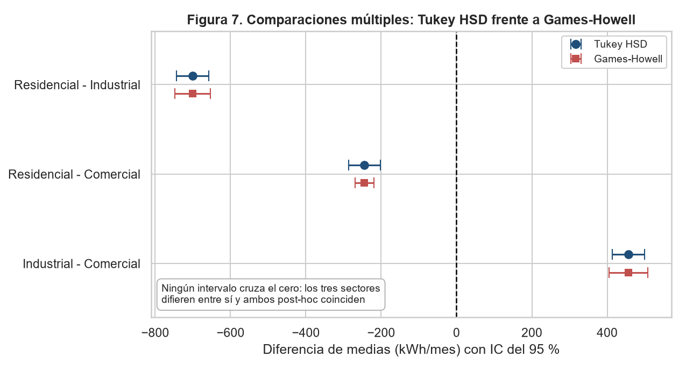
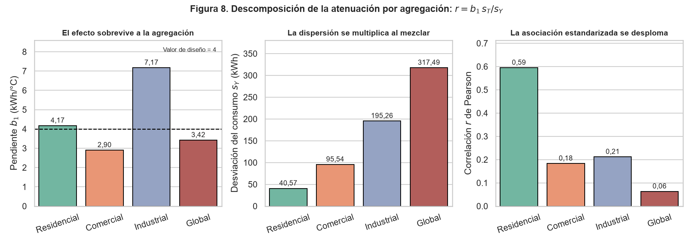
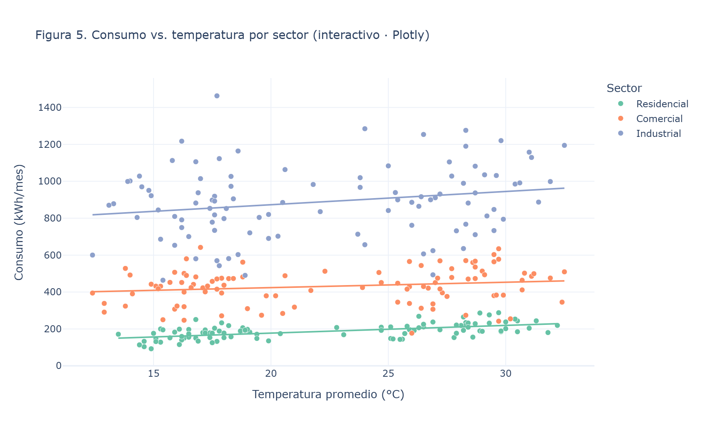
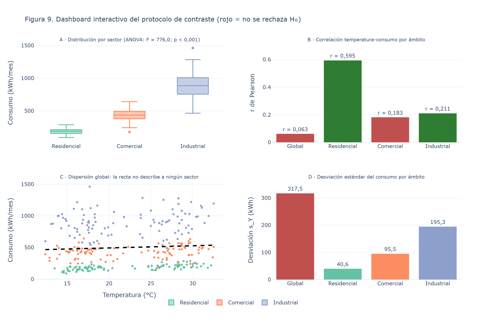
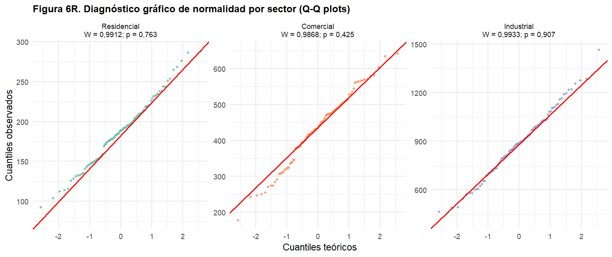
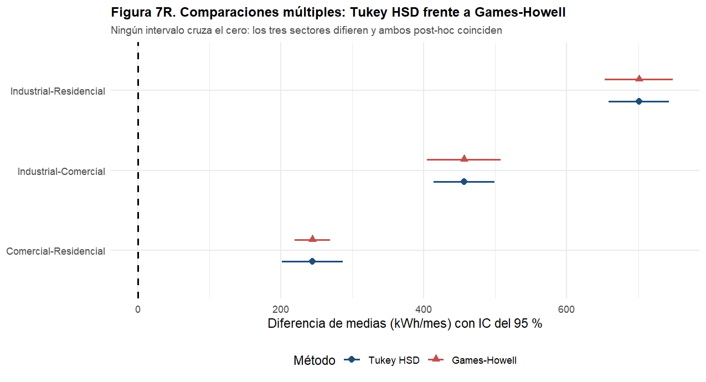
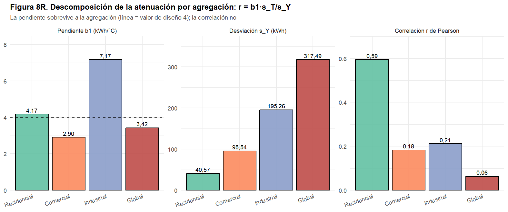
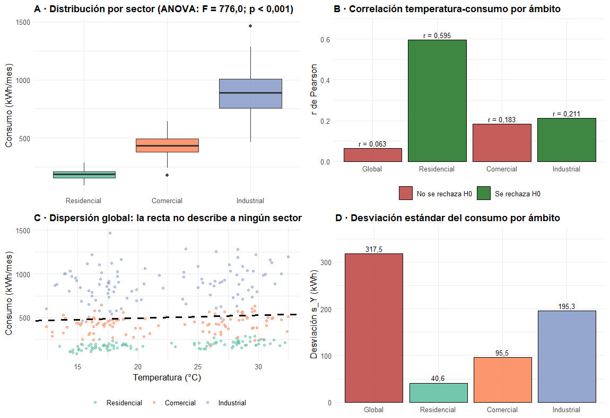

<div align="center">
    
</div>

# Pruebas de Hipótesis y Visualización Avanzada de Datos

## 📋 Información General

<div align="center">
    
</div>

| Aspecto | Detalles |
|--------|----------|
| **Autor** | Andrés Giovanny Rubiano Muñoz "Andy Rubiano" |
| **Correo** | arubiano67@unisalle.edu.co |
| **Asignatura** | Ciencia de Datos — Actividad 5 |
| **Docente** | Fabián Camilo Castro Riveros |
| **Unidad** | Unidad 2 · Pruebas de hipótesis y visualización interactiva |
| **Programa** | Maestría en Inteligencia Artificial |
| **Universidad** | Universidad de La Salle |
| **Herramientas** | Python 3.14.7 (SciPy + statsmodels + Matplotlib + Seaborn + Plotly) y R 4.6.1 (ggplot2 + plotly + grid) |
| **Figuras** | 9 en Python y 9 réplicas en R · 4 interactivas (2 por entorno) |
| **Año** | 2026 |
| **Estado** | Completado |

---

## 🎯 Descripción del Proyecto

Laboratorio de **inferencia estadística** sobre un conjunto de datos simulado de consumo mensual de energía de **300 clientes** colombianos (100 por sector: Residencial, Comercial e Industrial), cada uno con su región y la temperatura promedio del mes. Generado con la semilla fija `default_rng(42)`, el dataset es completamente reproducible.

Donde las actividades anteriores **describían** la distribución, esta la somete a **contraste de hipótesis**: cada afirmación sobre los datos se formula como una $H_0$, se elige la prueba adecuada, se verifican sus supuestos y se decide con un nivel de significancia de $\alpha = 0{,}05$. Cada resultado numérico se acompaña de la figura que lo hace visible.

El proyecto desarrolla:

- **Verificación de supuestos** — Shapiro-Wilk por sector (normalidad) y Levene/Bartlett (homogeneidad de varianzas), ejecutados **antes** de las pruebas paramétricas para justificar su uso.
- **Comparación de dos grupos** — prueba t de Student para muestras independientes con **corrección de Welch**, adoptada precisamente porque las varianzas resultaron heterogéneas.
- **Comparación de tres grupos** — ANOVA de un factor seguido del post-hoc de **Tukey HSD**, que identifica cuáles pares de sectores difieren y no solo si alguno lo hace.
- **Relación entre variables** — correlación de Pearson y regresión lineal por mínimos cuadrados (OLS) entre temperatura y consumo, evaluadas a nivel global y **desagregadas por sector**.
- **Tamaño del efecto y potencia** — *d* de Cohen con IC del 95 %, *g* de Hedges, η², ω² y potencia observada, porque un valor *p* dice si el efecto es distinguible del azar pero no si importa. Incluye la correlación mínima detectable con potencia del 80 %.
- **Robustez ante heterocedasticidad** — al rechazarse la homogeneidad de varianzas, todo el bloque de comparación de medias se **repite** con **ANOVA de Welch** y post-hoc de **Games-Howell**, implementados desde sus fórmulas. La decisión no cambia.
- **Visualización avanzada** — **nueve** figuras con Matplotlib, Seaborn y Plotly, **dos interactivas** (dispersión por sector y *dashboard* de cuatro paneles), replicadas íntegramente con ggplot2 en R. Cada figura lleva impreso el estadístico y el valor *p* que representa.
- **Verificación cruzada Python ↔ R** — R recalcula todo de forma independiente; los estadísticos, los valores *p*, los tamaños de efecto y los contrastes robustos coinciden **dígito a dígito**.

### El hallazgo central

> La correlación temperatura–consumo es **no significativa a nivel global** (r = 0,063; p = 0,277), pero **sí lo es dentro del sector Residencial** (r = 0,595; p < 0,001). La diferencia de escala entre sectores —de 187 a 888 kWh/mes— domina la variabilidad total y **enmascara** la relación real. Es un caso de manual de por qué una prueba de hipótesis sin su visualización puede llevar a la conclusión contraria: las Figuras 4 y 5 muestran de un vistazo lo que el coeficiente global oculta.

### Objetivos Principales

- Formular hipótesis estadísticas sobre el consumo energético y contrastarlas con la prueba adecuada a cada caso.
- Verificar los supuestos de normalidad y homocedasticidad antes de aplicar pruebas paramétricas, y corregir el procedimiento cuando no se cumplen.
- Aplicar correctamente `scipy.stats` y `statsmodels` en Python, y `t.test`, `aov` y `TukeyHSD` en R.
- Reportar el **tamaño del efecto** y la **potencia** junto a cada valor *p*, y verificar la robustez de las conclusiones cuando un supuesto no se cumple.
- Representar los resultados de cada prueba con Matplotlib, Seaborn, Plotly y ggplot2, incluyendo figuras **interactivas** y un **dashboard**.
- Interpretar los hallazgos en términos de decisión y no solo de significancia estadística.
- Validar el análisis mediante una implementación independiente en R sobre el mismo dataset.

---

## 📚 Estructura del Repositorio

```
.
├── README.md                                     # Este archivo
├── requirements.txt                              # Dependencias de Python
├── .gitignore                                    # Excluye venv/, __pycache__/, .Rhistory, .vscode/
├── data/
│   ├── dataset/
│   │   └── consumo_energia.csv                   # 300 registros generados (semilla 42, reproducible)
│   └── processed/
│       ├── normality_tests.csv                   # Shapiro-Wilk por sector + Levene (Python)
│       ├── ttest_results.csv                     # t de Welch, Residencial vs Comercial (Python)
│       ├── anova_results.csv                     # Tabla ANOVA de un factor (statsmodels)
│       ├── tukey_posthoc.csv                     # Comparaciones múltiples de Tukey (Python)
│       ├── regression_results.csv                # Pearson global y por sector + OLS (Python)
│       ├── effect_sizes.csv                      # d de Cohen, g de Hedges, eta2, omega2, potencia
│       ├── welch_anova.csv                       # ANOVA de Welch (sin homocedasticidad)
│       ├── games_howell.csv                      # Post-hoc de Games-Howell con IC del 95 %
│       └── *_r.csv                               # Las mismas siete tablas recalculadas en R
├── public/
│   └── assets/
│       └── images/
│           ├── Logo.png                          # Logo institucional
│           ├── author/                           # Foto del autor
│           └── figures/
│               ├── python/
│               │   └── hypothesis/               # 9 figuras PNG + 2 HTML interactivos de Plotly
│               └── r/
│                   └── hypothesis/               # Las 9 réplicas en ggplot2 + 2 HTML de ggplotly
└── utils/
    └── codes/
        ├── hypothesis_testing.py                 # Dataset, pruebas, efectos, robustez y 9 figuras
        └── hypothesis_testing.R                  # Recálculo independiente y 9 réplicas (R)
```

### Variables del dataset

| Variable | Tipo | Descripción |
|---|---|---|
| `id_cliente` | Nominal | Identificador único (CL-0001 a CL-0300) |
| `sector` | Nominal | Residencial, Comercial o Industrial (100 clientes cada uno) |
| `region` | Nominal | Andina, Caribe o Pacífica — determina la temperatura base |
| `temperatura_c` | Cuantitativa continua | Temperatura promedio del mes en °C |
| `consumo_kwh` | Cuantitativa continua | Consumo mensual en kilovatios-hora |

El consumo se construye como `N(μ_sector, σ_sector) + 4·(temperatura − 20)`, de modo que la relación con la temperatura **existe por diseño** y es idéntica en los tres sectores. Esto convierte al dataset en un banco de pruebas ideal: se sabe de antemano que la correlación es real, así que cuando la prueba global no la detecta, la causa solo puede ser el efecto de la agregación.

---

## 🔬 Hipótesis Contrastadas

| # | Hipótesis nula ($H_0$) | Prueba en Python | Prueba en R |
|---|---|---|---|
| 1 | El consumo de cada sector procede de una distribución normal | `scipy.stats.shapiro` | `shapiro.test` |
| 2 | Las varianzas de los tres sectores son homogéneas | `scipy.stats.levene` | `bartlett.test` |
| 3 | El consumo medio Residencial = Comercial | `scipy.stats.ttest_ind` (Welch) | `t.test(var.equal = FALSE)` |
| 4 | El consumo medio es igual en los tres sectores | `ols` + `anova_lm` + `pairwise_tukeyhsd` | `aov` + `TukeyHSD` |
| 5 | No existe relación lineal temperatura ↔ consumo (r = 0) | `scipy.stats.pearsonr` + `sm.OLS` | `cor.test` + `lm` |

Las hipótesis 1 y 2 no son un trámite: **condicionan** las siguientes. Al rechazarse la homogeneidad de varianzas, la prueba t se ejecuta con la corrección de Welch en lugar de la versión clásica.

---

## 🧪 Pipeline del Laboratorio

El flujo es **secuencial**: Python genera los datos, ejecuta las cinco pruebas, exporta las tablas y produce las figuras; R consume el mismo CSV, recalcula todo de forma independiente y replica las gráficas con ggplot2, permitiendo la verificación cruzada.

### Fase 1 · Pruebas de hipótesis y figuras en Python

[`hypothesis_testing.py`](utils/codes/hypothesis_testing.py) genera el dataset con semilla fija, aplica las cinco pruebas con `scipy.stats` y `statsmodels`, calcula los tamaños de efecto y los contrastes robustos, y produce las nueve figuras con Matplotlib, Seaborn y Plotly.

| Salida | Ubicación | Descripción |
|---|---|---|
| Dataset | `data/dataset/consumo_energia.csv` | 300 registros: cliente, sector, región, temperatura (°C), consumo (kWh) |
| Supuestos | `data/processed/normality_tests.csv` | Shapiro-Wilk por sector y Levene sobre los tres grupos |
| Prueba t | `data/processed/ttest_results.csv` | Medias, estadístico t de Welch, valor *p* y decisión |
| ANOVA | `data/processed/anova_results.csv` | Suma de cuadrados, grados de libertad, F y `PR(>F)` |
| Post-hoc | `data/processed/tukey_posthoc.csv` | Las tres comparaciones por pares con IC del 95 % |
| Regresión | `data/processed/regression_results.csv` | Pearson global y por sector, $b_0$, $b_1$, $s_Y$ y $R^2$ |
| Efectos | `data/processed/effect_sizes.csv` | *d* de Cohen con IC, *g* de Hedges, η², ω², potencia y $r_{mín}$ |
| Robustez | `data/processed/welch_anova.csv` · `games_howell.csv` | ANOVA de Welch y post-hoc sin homocedasticidad |
| Figuras | `public/assets/images/figures/python/hypothesis/` | 9 PNG estáticos + 2 HTML interactivos (Figuras 5 y 9) |

### Fase 2 · Recálculo y verificación en R

[`hypothesis_testing.R`](utils/codes/hypothesis_testing.R) lee el CSV de la Fase 1 y **no reutiliza ningún valor de Python**: vuelve a ejecutar las cinco pruebas con las funciones nativas de R, recalcula los tamaños de efecto y los contrastes robustos, y redibuja las nueve figuras con ggplot2.

| Salida | Ubicación | Descripción |
|---|---|---|
| Tablas | `data/processed/*_r.csv` | Las mismas siete tablas, recalculadas de forma independiente |
| Figuras | `public/assets/images/figures/r/hypothesis/` | Las 9 réplicas en ggplot2 + 2 HTML de `ggplotly` |
| Verificación | Consola | Estadísticos y valores *p* — deben coincidir con los CSV de Python |

**Características clave:**

- **Reproducibilidad:** semilla fija (`default_rng(42)`); cualquier ejecución produce los mismos 300 registros, las mismas tablas y las mismas figuras.
- **Rutas:** ambos scripts usan rutas **relativas a la raíz del proyecto**, así que deben ejecutarse desde ahí; Python crea las carpetas de salida si no existen (`os.makedirs`), igual que R con `dir.create(recursive = TRUE)`.
- **Verificación cruzada:** Shapiro-Wilk, la t de Welch, la tabla ANOVA, Tukey y la regresión coinciden **dígito a dígito** entre Python y R. La única diferencia esperada es la prueba de varianzas: Python usa **Levene** (basada en desviaciones absolutas respecto a la media) y R usa **Bartlett** (basada en el cociente de verosimilitudes), dos estadísticos distintos que aquí conducen a la misma decisión.
- **Interactividad:** las Figuras 5 y 9 de Python se exportan como HTML de Plotly con zoom, filtrado por leyenda y *hover* que revela el identificador del cliente y su región. Aislar un sector desde la leyenda **equivale a ejecutar el análisis condicionado**, que es la operación que separa la conclusión correcta de la equivocada. R ofrece las versiones equivalentes vía `plotly::ggplotly` cuando el paquete está instalado.

---

## ⚙️ Requisitos

### Python

> ⚠️ **Versión:** Python 3.10 o superior, con entorno virtual dedicado (`venv/`). Probado en **3.14.7**.

| Dependencia | Mínima | Probada | Uso |
|---|---|---|---|
| `numpy` | 1.24 | 2.5.2 | Generación del dataset con semilla fija |
| `pandas` | 2.0 | 3.0.5 | Estructuración de datos y exportación de las tablas a CSV |
| `scipy` | 1.10 | 1.18.1 | Shapiro-Wilk, Levene, t de Student y Pearson |
| `statsmodels` | 0.14 | 0.14.6 | ANOVA (`ols` + `anova_lm`), Tukey HSD y regresión OLS |
| `matplotlib` | 3.7 | 3.11.1 | Figuras 1 y 3 |
| `seaborn` | 0.13 | 0.13.2 | Figuras 2 y 4, y el tema visual común |
| `plotly` | 5.18 | 6.9.0 | Figura 5 interactiva |
| `kaleido` | 0.2 | 1.3.0 | Exportación del PNG estático de Plotly |

> ℹ️ **Sobre el PNG de Plotly:** desde `kaleido` 1.x la exportación la resuelve `choreographer`, que descarga su propio navegador la primera vez. Ya no hace falta instalar Chrome ni ejecutar `plotly_get_chrome` manualmente.

### R

- **R 4.x** (probado en **4.6.1**) — requiere **`ggplot2`** (probado en 4.0.3) para las nueve réplicas. El *dashboard* estático se compone con `grid`, que viene con R y no exige `patchwork` ni `gridExtra`.
- `plotly` y `htmlwidgets` para la versión interactiva vía `ggplotly` — recomendados, ya que la actividad pide visualización interactiva también en RStudio.
- Las pruebas estadísticas usan funciones de R base (`stats`): `shapiro.test`, `bartlett.test`, `t.test`, `aov`, `TukeyHSD`, `cor.test`, `lm` y `oneway.test` — sin dependencias adicionales. Games-Howell se implementa sobre `ptukey` y `qtukey`, y la potencia sobre las distribuciones no centrales `pt` y `pf`.
- Editor: RStudio Desktop o VS Code con la extensión **R** (REditorSupport) + `languageserver`.

---

## 🛠️ Ejecución

> Ambos comandos se lanzan **desde la raíz del proyecto** (`hypothesis_visualizations/`), porque los scripts resuelven sus rutas de forma relativa.

```bash
# 1. Entorno de Python
python -m venv venv
source venv/Scripts/activate    # Git Bash (en PowerShell: venv\Scripts\activate)
pip install -r requirements.txt

# 2. Fase 1: dataset, pruebas de hipótesis y figuras de Python
python utils/codes/hypothesis_testing.py

# Dataset, pruebas, efectos, robustez y 9 figuras
Rscript utils/codes/hypothesis_testing.R
```

```r
# Paquetes de R (solo la primera vez)
install.packages("ggplot2")                     # obligatorio
install.packages(c("plotly", "htmlwidgets"))    # opcional: versión interactiva en R
```

Si `Rscript` no está en el `PATH` de Git Bash, añádelo a la sesión antes del paso 3:

```bash
export PATH="/c/Program Files/R/R-4.6.1/bin/x64:$PATH"
```

Ambos scripts terminan con código de salida `0`. El de R guarda la figura interactiva como HTML autocontenido cuando encuentra **pandoc**; si no —el caso habitual al invocarlo con `Rscript`— la guarda con su carpeta `fig5_interactivo_r_files/` adjunta, que es igual de interactiva. En ninguno de los dos casos se interrumpe la ejecución.

---

## 🖼️ Galería de Figuras

### Supuestos y comparación de grupos (Python · Matplotlib y Seaborn)

| | |
|---|---|
|  |  |
| **Figura 1 · Normalidad (Matplotlib)** — histograma del sector Residencial con la curva normal teórica superpuesta: la coincidencia visual respalda el p = 0,763 de Shapiro-Wilk | **Figura 2 · Violín y caja por sector (Seaborn)** — distribuciones sin traslape y amplitudes crecientes, con el ANOVA y su η² rotulados sobre la figura |

| | |
|---|---|
|  |  |
| **Figura 3 · Medias con IC del 95 % (Matplotlib)** — las letras (a), (b) y (c) codifican Tukey: letras distintas significan diferencia significativa | **Figura 4 · Regresión (Seaborn)** — dispersión temperatura vs. consumo con la recta OLS, su banda de confianza y el contraste de Pearson rotulado |

### Diagnóstico, post-hoc y atenuación (Python · Matplotlib y Seaborn)

<div align="center">
    
</div>

**Figura 6 · Q-Q plots por sector (Matplotlib)** — el histograma resuelve el centro de la distribución pero pierde resolución en las colas, que es donde una desviación de la normalidad invalidaría las pruebas paramétricas. Los tres sectores se alinean sobre la diagonal en todo el recorrido.

<div align="center">
    
</div>

**Figura 7 · Tukey HSD frente a Games-Howell (Matplotlib)** — convierte una limitación en una comprobación. Las diferencias puntuales son idénticas; lo que cambia es la precisión: Games-Howell **estrecha** el intervalo entre los dos sectores de menor varianza y lo **ensancha** en los que involucran a Industrial. Ningún intervalo cruza el cero, así que la decisión no depende del supuesto de homocedasticidad.

<div align="center">
    
</div>

**Figura 8 · Descomposición de la atenuación (Seaborn)** — los tres paneles se leen como una cadena causal sobre la identidad *r = b₁·s_T/s_Y*: la pendiente global (3,42) se mantiene cerca del valor de diseño, la desviación del consumo se multiplica por casi ocho al mezclar sectores (40,6 → 317,5 kWh), y la correlación se desploma en la misma proporción.

### Figura interactiva (Python · Plotly)

<div align="center">
    
</div>

**Figura 5 · Consumo vs. temperatura por sector (Plotly)** — tres rectas de regresión **paralelas y de pendiente positiva**, separadas por el nivel de cada sector. Es la imagen que explica el hallazgo central: la relación existe dentro de cada grupo, pero al mezclarlos la distancia vertical entre ellos la anula.

La versión interactiva se exporta como [`fig5_interactivo_plotly.html`](public/assets/images/figures/python/hypothesis/fig5_interactivo_plotly.html): al abrirla en el navegador permite hacer zoom, aislar sectores desde la leyenda y ver el identificador y la región de cada cliente al pasar el ratón. El PNG de arriba es la captura estática que genera `kaleido` para insertarla en el informe.

### Dashboard interactivo (Python · Plotly)

<div align="center">
    
</div>

**Figura 9 · Dashboard del protocolo de contraste (Plotly)** — reúne las cuatro decisiones en una sola vista, porque la contradicción que articula el laboratorio solo aparece al poner un resultado junto a otro: el panel **A** separa los sectores sin traslape, el **B** muestra que ese mismo conjunto declara no significativa la correlación global mientras la del Residencial es la mayor de las cuatro, el **C** exhibe la recta agregada atravesando tres franjas que no describe, y el **D** identifica al responsable, la desviación del consumo. Versión interactiva en [`fig9_dashboard_plotly.html`](public/assets/images/figures/python/hypothesis/fig9_dashboard_plotly.html).

### Réplica en R (ggplot2)

Las nueve figuras tienen su equivalente en ggplot2, construidas sobre estadísticos recalculados de forma independiente.

| | |
|---|---|
|  |  |
| **Figura 1R** — `geom_histogram` + `stat_function(dnorm)` | **Figura 2R** — `geom_boxplot` con relleno por sector |
|  |  |
| **Figura 3R** — `geom_col` + `geom_errorbar` con los IC del 95 % | **Figura 4R** — `geom_point` + `geom_smooth(method = "lm")` |

<div align="center">
    
</div>

**Figura 5R · Dispersión por sector (ggplot2)** — la réplica de la Figura 5, con una recta de regresión por sector y las mismas tres pendientes paralelas. El script la convierte además en interactiva con `ggplotly`, guardándola en [`fig5_interactivo_r.html`](public/assets/images/figures/r/hypothesis/fig5_interactivo_r.html): la contraparte en RStudio de la figura de Plotly, con el mismo zoom, filtrado por leyenda y *hover*.

| | |
|---|---|
|  |  |
| **Figura 6R** — `stat_qq` + `stat_qq_line` con `facet_wrap` por sector | **Figura 7R** — `geom_pointrange` con `position_dodge`, Tukey frente a Games-Howell |

<div align="center">
    
</div>

**Figura 8R · Descomposición de la atenuación (ggplot2)** — `geom_col` + `facet_wrap(scales = "free_y")` sobre los tres términos de la identidad *r = b₁·s_T/s_Y*.

<div align="center">
    
</div>

**Figura 9R · Dashboard del protocolo (ggplot2)** — la retícula de cuatro paneles se compone con `grid`, que viene con R base y evita depender de `patchwork`. La versión interactiva se genera con `plotly::subplot` sobre los mismos objetos y se guarda en [`fig9_dashboard_r.html`](public/assets/images/figures/r/hypothesis/fig9_dashboard_r.html).

---

## 📊 Resultados

Todas las pruebas se evalúan con $\alpha = 0{,}05$.

### 1. Verificación de supuestos

| Prueba | Grupo | Estadístico | *p* | Decisión |
|---|---|---|---|---|
| Shapiro-Wilk | Residencial | 0,9912 | 0,7628 | No se rechaza $H_0$ → **normal** |
| Shapiro-Wilk | Comercial | 0,9868 | 0,4246 | No se rechaza $H_0$ → **normal** |
| Shapiro-Wilk | Industrial | 0,9933 | 0,9069 | No se rechaza $H_0$ → **normal** |
| Levene (Python) | Los 3 sectores | 60,43 | < 0,001 | Se rechaza $H_0$ → **varianzas distintas** |
| Bartlett (R) | Los 3 sectores | 199,39 | < 0,001 | Se rechaza $H_0$ → **varianzas distintas** |

La normalidad se cumple en los tres sectores, lo que habilita las pruebas paramétricas. La homocedasticidad **no**: la desviación estándar pasa de 40,6 kWh en Residencial a 195,3 en Industrial. Por eso la prueba t se ejecuta con la corrección de Welch.

### 2. Prueba t de Student (Welch) · Residencial vs. Comercial

| Grupo | n | Media (kWh) | Desv. est. | t | *p* | Decisión |
|---|---|---|---|---|---|---|
| Residencial | 100 | 186,98 | 40,57 | −23,54 | 2,3 × 10⁻⁴⁹ | Se rechaza $H_0$ |
| Comercial | 100 | 431,30 | 95,54 | | | |

El consumo medio comercial **más que duplica** al residencial. La magnitud del estadístico deja el resultado fuera de cualquier duda razonable.

### 3. ANOVA de un factor + post-hoc de Tukey

| Fuente | Suma de cuadrados | gl | F | *p* |
|---|---|---|---|---|
| Sector | 25 298 262,0 | 2 | **775,99** | 1,2 × 10⁻¹¹⁸ |
| Residual | 4 841 297,4 | 297 | | |

| Comparación | Diferencia de medias | IC 95 % | *p* ajustado |
|---|---|---|---|
| Industrial − Comercial | +456,37 | [413,84 ; 498,90] | < 0,001 |
| Residencial − Comercial | −244,33 | [−286,86 ; −201,80] | < 0,001 |
| Residencial − Industrial | −700,70 | [−743,23 ; −658,17] | < 0,001 |

El sector explica el **83,9 %** de la variabilidad del consumo ($SC_{sector} / SC_{total}$). Tukey confirma que **las tres** comparaciones por pares son significativas: no hay dos sectores que puedan tratarse como equivalentes.

### 3-bis. Tamaño del efecto, potencia y robustez

Un valor *p* dice si el efecto es distinguible del azar; no dice si importa. Con n = 100 por grupo casi cualquier diferencia alcanza la significancia, así que cada contraste va acompañado de su magnitud.

| Medida | Valor | IC 95 % | Lectura |
|---|---|---|---|
| *d* de Cohen (Res. vs. Com.) | **3,329** | [2,901 ; 3,757] | Efecto muy grande |
| *g* de Hedges | 3,316 | — | La corrección apenas altera la cifra |
| η² (sector) | 0,839 | — | Varianza explicada |
| ω² (sector) | 0,838 | — | Coincide con η²: no está inflada |
| *f* de Cohen (sector) | 2,286 | — | Muy por encima de 0,40 |
| Potencia (*t* y ANOVA) | > 0,999 | — | Máxima |
| $r_{mín}$ detectable (n = 300, potencia 0,80) | **0,161** | — | El *r* global (0,063) **queda por debajo** |

La última fila es la que cierra el argumento del laboratorio: la correlación global no es no-significativa por falta de muestra, sino porque el coeficiente estandarizado se volvió realmente pequeño. El del sector Residencial (0,595) supera el umbral con holgura.

Como Levene y Bartlett rechazan la homocedasticidad —supuesto que el ANOVA clásico y Tukey asumen—, el bloque completo se repite sin ese supuesto:

| Procedimiento | *F* / diferencia | gl | *p* |
|---|---|---|---|
| ANOVA clásico | 775,99 | 2 ; 297 | < 0,001 |
| **ANOVA de Welch** | **830,22** | 2 ; 156,1 | < 0,001 |
| Tukey: Ind. − Res. | +700,70 | 297 | < 0,001 |
| **Games-Howell**: Ind. − Res. | +700,70 | 107,5 | < 0,001 |
| Tukey: Com. − Res. | +244,33 | 297 | < 0,001 |
| **Games-Howell**: Com. − Res. | +244,33 | 133,6 | < 0,001 |
| Tukey: Ind. − Com. | +456,37 | 297 | < 0,001 |
| **Games-Howell**: Ind. − Com. | +456,37 | 143,8 | < 0,001 |

**La decisión no cambia.** Lo que cambia es la precisión de cada intervalo (ver Figura 7). Ni el ANOVA de Welch ni Games-Howell existen en `scipy` o `statsmodels`, así que se implementaron desde sus fórmulas —y desde cero otra vez en R— lo que hace la verificación cruzada mucho más exigente que comparar dos bibliotecas maduras del mismo algoritmo.

### 4. Correlación y regresión temperatura ↔ consumo

| Ámbito | r de Pearson | *p* | Decisión |
|---|---|---|---|
| **Global** (300 clientes) | 0,063 | 0,277 | Sin relación significativa |
| Residencial | **0,595** | < 0,001 | **Relación significativa** |
| Industrial | 0,212 | 0,035 | Relación significativa |
| Comercial | 0,183 | 0,069 | Sin relación significativa |

Regresión global: $\widehat{consumo} = 425{,}65 + 3{,}42 \cdot temperatura$, con $R^2 = 0{,}004$.

Aquí está el resultado más interesante del laboratorio. El modelo global es **estadísticamente inútil** —explica el 0,4 % de la varianza— pese a que la temperatura sí influye en el consumo por construcción del dataset. La explicación es que la variabilidad **entre** sectores (887 vs. 187 kWh) es un orden de magnitud mayor que el efecto de la temperatura (≈ 4 kWh por grado), de modo que al mezclarlos el ruido de la agregación sepulta la señal. Al condicionar por sector, la relación emerge: en Residencial —donde la dispersión interna es menor— alcanza r = 0,595.

La detección es **visual antes que numérica**: en la Figura 4 la nube global parece plana, mientras que en la Figura 5, al colorear por sector, aparecen tres pendientes positivas paralelas. Es la justificación empírica de por qué la visualización acompaña a la prueba de hipótesis y no la sustituye ni la decora.

### 5. Verificación cruzada Python ↔ R

| Prueba | Python | R | Coincidencia |
|---|---|---|---|
| Shapiro-Wilk (3 sectores) | 0,9912 / 0,9868 / 0,9933 | idénticos | ✅ dígito a dígito |
| t de Welch | t = −23,5384 | t = −23,5384 | ✅ dígito a dígito |
| ANOVA | F = 775,9887 | F = 775,9887 | ✅ dígito a dígito |
| Tukey HSD | +456,371 / −244,327 / −700,698 | idénticos | ✅ dígito a dígito |
| Pearson + regresión | r = 0,063; $b_1$ = 3,42 | r = 0,063; $b_1$ = 3,42 | ✅ dígito a dígito |
| *d* de Cohen | 3,3288 [2,9008 ; 3,7569] | 3,3288 [2,9008 ; 3,7569] | ✅ dígito a dígito |
| η² / ω² | 0,8394 / 0,8378 | 0,8394 / 0,8378 | ✅ dígito a dígito |
| Potencia (*t* / ANOVA) | 1,0000 / 1,0000 | 1,0000 / 1,0000 | ✅ dígito a dígito |
| ANOVA de Welch | F = 830,2239; gl₂ = 156,12 | F = 830,2239; gl₂ = 156,12 | ✅ dígito a dígito |
| Games-Howell | +244,33 / +700,70 / +456,37 | idénticos | ✅ dígito a dígito |
| Varianzas | Levene = 60,43 | Bartlett = 199,39 | ⚠️ pruebas distintas, misma decisión |

### Implicaciones para la decisión

- **Segmentar antes de promediar.** Cualquier tarifa, meta de eficiencia o proyección de demanda construida sobre la media global (501,98 kWh) no describe a ningún cliente real: está entre el Comercial y el Residencial y no representa a ninguno.
- **La temperatura es una variable de planeación, pero solo dentro del segmento residencial.** Ahí un aumento de 1 °C se traduce en consumo adicional medible, lo que la vuelve útil para anticipar picos de demanda en las regiones Caribe y Pacífica.
- **Ningún par de sectores es agrupable.** Los tres intervalos de Tukey excluyen el cero por márgenes amplios, así que un modelo tarifario de dos escalones perdería información frente a uno de tres.

---

## 🔑 Palabras Clave

`Pruebas de Hipótesis` · `ANOVA` · `ANOVA de Welch` · `Tukey HSD` · `Games-Howell` · `Prueba t de Welch` · `Shapiro-Wilk` · `Tamaño del Efecto` · `d de Cohen` · `Potencia Estadística` · `Correlación de Pearson` · `Regresión OLS` · `SciPy` · `statsmodels` · `Matplotlib` · `Seaborn` · `Plotly` · `ggplot2` · `Visualización Interactiva` · `Dashboard` · `Ciencia de Datos`

---

## 📧 Contacto

**Andrés Giovanny Rubiano Muñoz**
Maestría en Inteligencia Artificial · Universidad de La Salle
arubiano67@unisalle.edu.co

---

## 📄 Derechos Reservados

© 2026 Andrés Giovanny Rubiano Muñoz (Andy Rubiano). Todos los derechos reservados.

Este laboratorio y su contenido —código, datos y documentación— son propiedad intelectual conjunta de:

- **Andrés Giovanny Rubiano Muñoz** (Andy Rubiano) — Autor
- **Universidad de La Salle** — Institución académica

El uso, reproducción o distribución requiere autorización previa escrita de los titulares de derechos.
