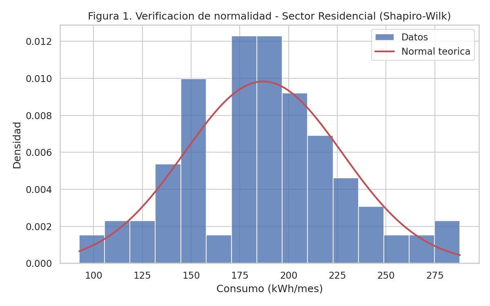
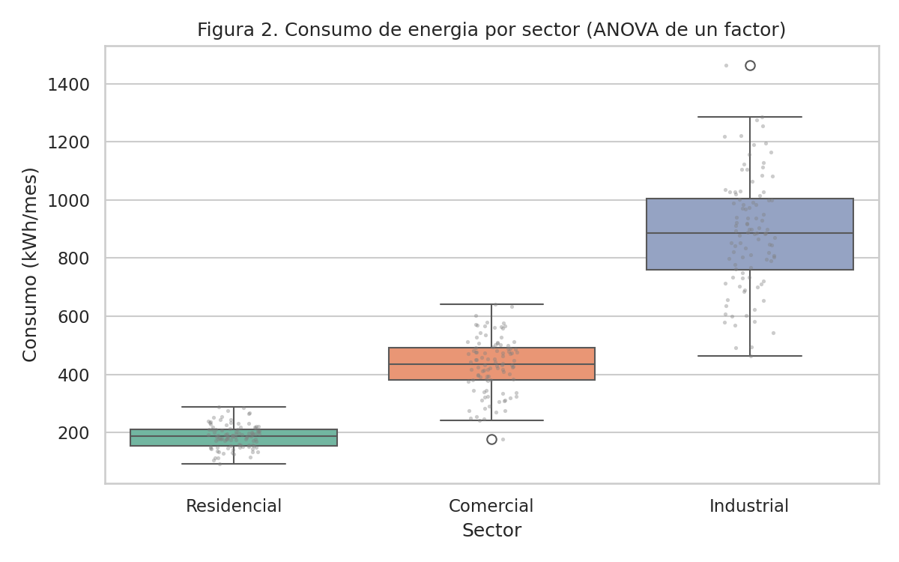
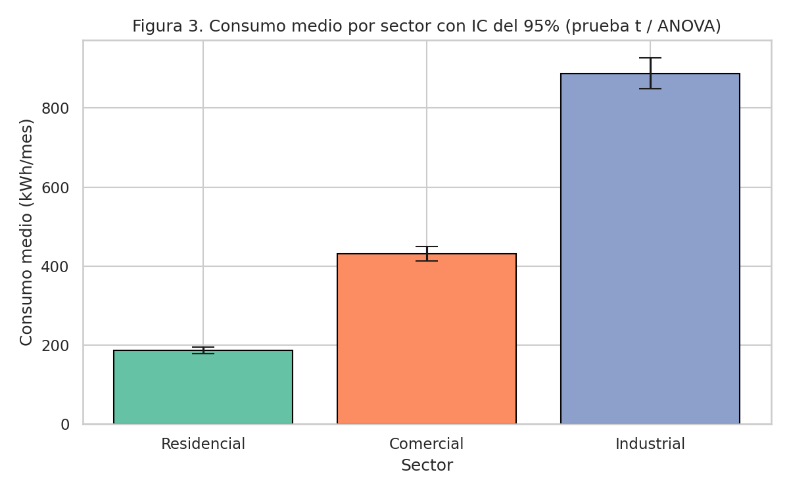
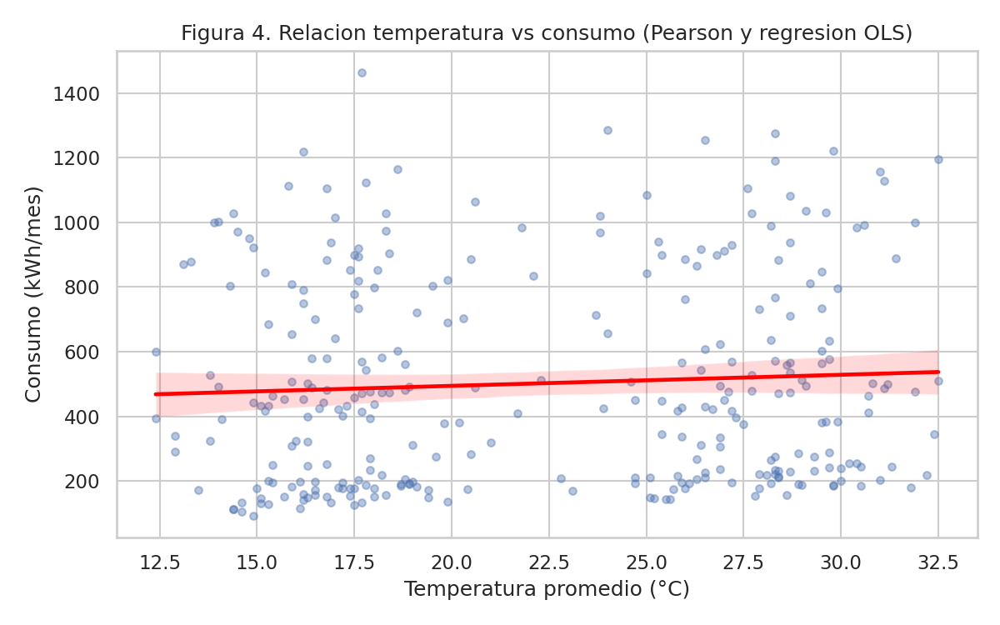
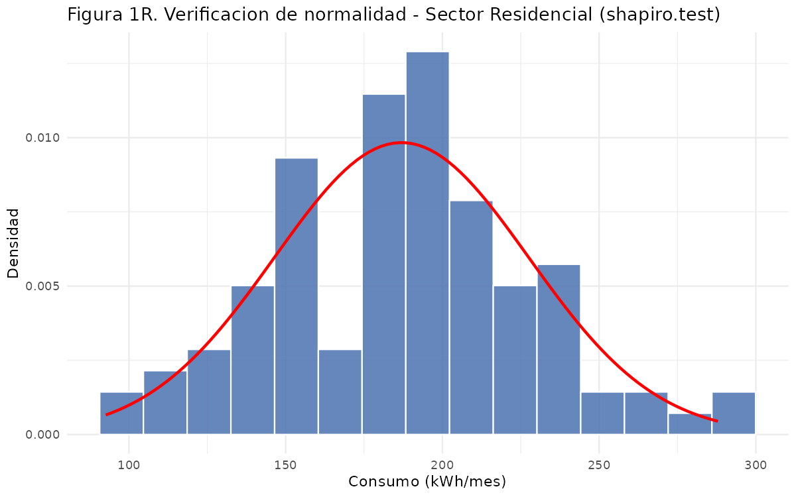
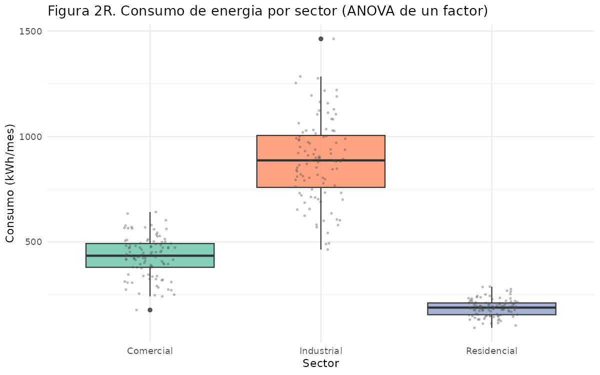
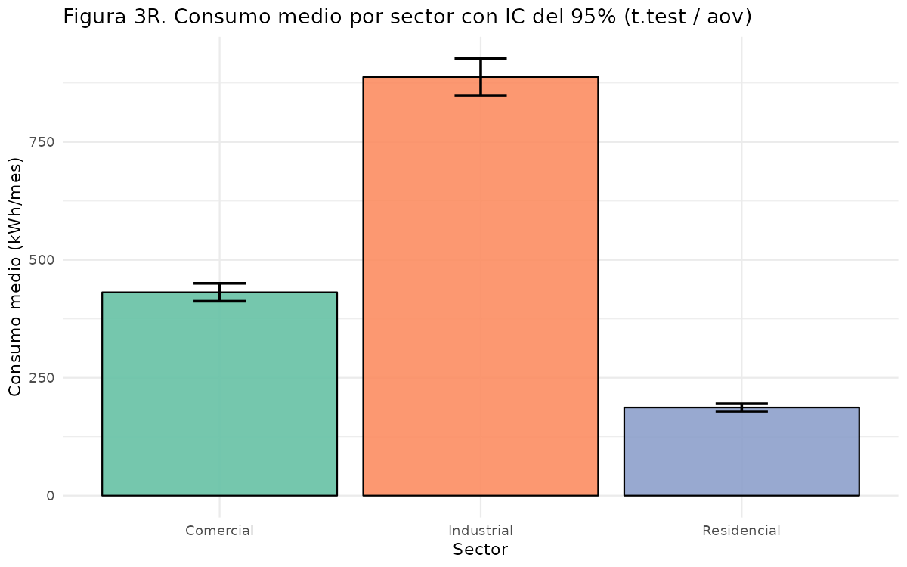
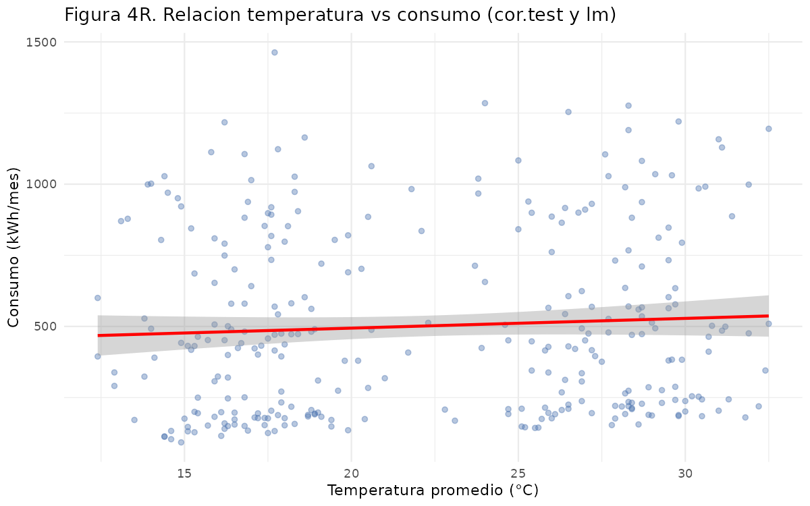
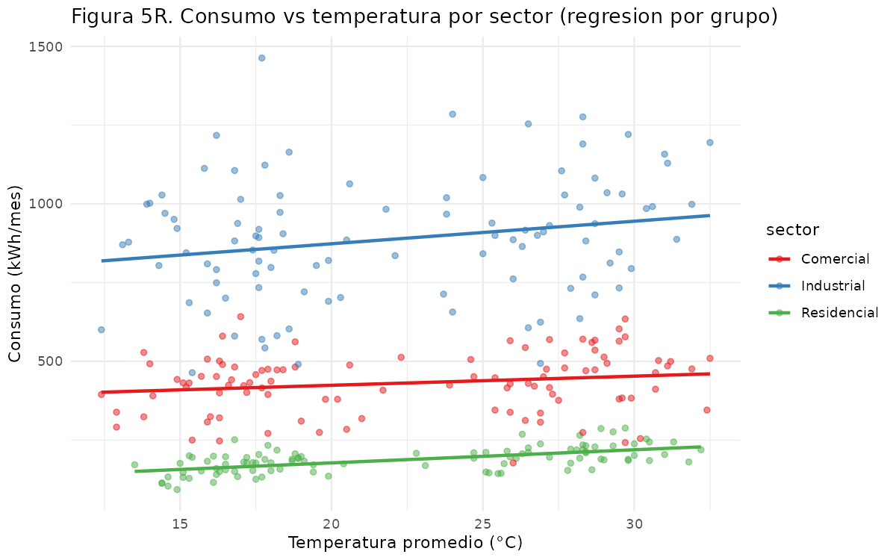

<div align="center">
    
</div>

# Pruebas de Hipótesis y Visualización Avanzada de Datos

## 📋 Información General

<div align="center">
    
</div>

| Aspecto | Detalles |
|--------|----------|
| **Autor** | Andrés Giovanny Rubiano Muñoz "Andy Rubiano" |
| **Correo** | arubiano67@unisalle.edu.co |
| **Asignatura** | Ciencia de Datos — Actividad 5 |
| **Docente** | Fabián Camilo Castro Riveros |
| **Unidad** | Unidad 2 · Pruebas de hipótesis y visualización interactiva |
| **Programa** | Maestría en Inteligencia Artificial |
| **Universidad** | Universidad de La Salle |
| **Herramientas** | Python 3.10+ (SciPy + statsmodels + Matplotlib + Seaborn + Plotly) y R 4.x (ggplot2) |
| **Año** | 2026 |
| **Estado** | Completado |

---

## 🎯 Descripción del Proyecto

Laboratorio de **inferencia estadística** sobre un conjunto de datos simulado de consumo mensual de energía de **300 clientes** colombianos (100 por sector: Residencial, Comercial e Industrial), cada uno con su región y la temperatura promedio del mes. Generado con la semilla fija `default_rng(42)`, el dataset es completamente reproducible.

Donde las actividades anteriores **describían** la distribución, esta la somete a **contraste de hipótesis**: cada afirmación sobre los datos se formula como una $H_0$, se elige la prueba adecuada, se verifican sus supuestos y se decide con un nivel de significancia de $\alpha = 0{,}05$. Cada resultado numérico se acompaña de la figura que lo hace visible.

El proyecto desarrolla:

- **Verificación de supuestos** — Shapiro-Wilk por sector (normalidad) y Levene/Bartlett (homogeneidad de varianzas), ejecutados **antes** de las pruebas paramétricas para justificar su uso.
- **Comparación de dos grupos** — prueba t de Student para muestras independientes con **corrección de Welch**, adoptada precisamente porque las varianzas resultaron heterogéneas.
- **Comparación de tres grupos** — ANOVA de un factor seguido del post-hoc de **Tukey HSD**, que identifica cuáles pares de sectores difieren y no solo si alguno lo hace.
- **Relación entre variables** — correlación de Pearson y regresión lineal por mínimos cuadrados (OLS) entre temperatura y consumo, evaluadas a nivel global y **desagregadas por sector**.
- **Visualización avanzada** — cinco figuras con Matplotlib, Seaborn y Plotly, replicadas íntegramente con ggplot2 en R.
- **Verificación cruzada Python ↔ R** — R recalcula las cinco pruebas de forma independiente; los estadísticos y los valores *p* coinciden **dígito a dígito**.

### El hallazgo central

> La correlación temperatura–consumo es **no significativa a nivel global** (r = 0,063; p = 0,277), pero **sí lo es dentro del sector Residencial** (r = 0,595; p < 0,001). La diferencia de escala entre sectores —de 187 a 888 kWh/mes— domina la variabilidad total y **enmascara** la relación real. Es un caso de manual de por qué una prueba de hipótesis sin su visualización puede llevar a la conclusión contraria: las Figuras 4 y 5 muestran de un vistazo lo que el coeficiente global oculta.

### Objetivos Principales

- Formular hipótesis estadísticas sobre el consumo energético y contrastarlas con la prueba adecuada a cada caso.
- Verificar los supuestos de normalidad y homocedasticidad antes de aplicar pruebas paramétricas, y corregir el procedimiento cuando no se cumplen.
- Aplicar correctamente `scipy.stats` y `statsmodels` en Python, y `t.test`, `aov` y `TukeyHSD` en R.
- Representar los resultados de cada prueba con Matplotlib, Seaborn, Plotly y ggplot2, incluyendo una figura **interactiva**.
- Interpretar los hallazgos en términos de decisión y no solo de significancia estadística.
- Validar el análisis mediante una implementación independiente en R sobre el mismo dataset.

---

## 📚 Estructura del Repositorio

```
.
├── README.md                                     # Este archivo
├── requirements.txt                              # Dependencias de Python
├── .gitignore                                    # Excluye venv/, __pycache__/, .Rhistory, .vscode/
├── data/
│   ├── dataset/
│   │   └── consumo_energia.csv                   # 300 registros generados (semilla 42, reproducible)
│   └── processed/
│       ├── normality_tests.csv                   # Shapiro-Wilk por sector + Levene (Python)
│       ├── ttest_results.csv                     # t de Welch, Residencial vs Comercial (Python)
│       ├── anova_results.csv                     # Tabla ANOVA de un factor (statsmodels)
│       ├── tukey_posthoc.csv                     # Comparaciones múltiples de Tukey (Python)
│       ├── regression_results.csv                # Pearson global y por sector + OLS (Python)
│       └── *_r.csv                               # Las mismas cinco tablas recalculadas en R
├── public/
│   └── assets/
│       └── images/
│           ├── Logo.png                          # Logo institucional
│           ├── author/                           # Foto del autor
│           └── figures/
│               ├── python/
│               │   └── hypothesis/               # 4 figuras PNG (Matplotlib/Seaborn) + 1 HTML (Plotly)
│               └── r/
│                   └── hypothesis/               # Las 5 figuras replicadas con ggplot2
└── utils/
    └── codes/
        ├── hypothesis_testing.py                 # Dataset, cinco pruebas y cinco figuras (Python)
        └── hypothesis_testing.R                  # Recálculo independiente y réplicas (R)
```

### Variables del dataset

| Variable | Tipo | Descripción |
|---|---|---|
| `id_cliente` | Nominal | Identificador único (CL-0001 a CL-0300) |
| `sector` | Nominal | Residencial, Comercial o Industrial (100 clientes cada uno) |
| `region` | Nominal | Andina, Caribe o Pacífica — determina la temperatura base |
| `temperatura_c` | Cuantitativa continua | Temperatura promedio del mes en °C |
| `consumo_kwh` | Cuantitativa continua | Consumo mensual en kilovatios-hora |

El consumo se construye como `N(μ_sector, σ_sector) + 4·(temperatura − 20)`, de modo que la relación con la temperatura **existe por diseño** y es idéntica en los tres sectores. Esto convierte al dataset en un banco de pruebas ideal: se sabe de antemano que la correlación es real, así que cuando la prueba global no la detecta, la causa solo puede ser el efecto de la agregación.

---

## 🔬 Hipótesis Contrastadas

| # | Hipótesis nula ($H_0$) | Prueba en Python | Prueba en R |
|---|---|---|---|
| 1 | El consumo de cada sector procede de una distribución normal | `scipy.stats.shapiro` | `shapiro.test` |
| 2 | Las varianzas de los tres sectores son homogéneas | `scipy.stats.levene` | `bartlett.test` |
| 3 | El consumo medio Residencial = Comercial | `scipy.stats.ttest_ind` (Welch) | `t.test(var.equal = FALSE)` |
| 4 | El consumo medio es igual en los tres sectores | `ols` + `anova_lm` + `pairwise_tukeyhsd` | `aov` + `TukeyHSD` |
| 5 | No existe relación lineal temperatura ↔ consumo (r = 0) | `scipy.stats.pearsonr` + `sm.OLS` | `cor.test` + `lm` |

Las hipótesis 1 y 2 no son un trámite: **condicionan** las siguientes. Al rechazarse la homogeneidad de varianzas, la prueba t se ejecuta con la corrección de Welch en lugar de la versión clásica.

---

## 🧪 Pipeline del Laboratorio

El flujo es **secuencial**: Python genera los datos, ejecuta las cinco pruebas, exporta las tablas y produce las figuras; R consume el mismo CSV, recalcula todo de forma independiente y replica las gráficas con ggplot2, permitiendo la verificación cruzada.

### Fase 1 · Pruebas de hipótesis y figuras en Python

[`hypothesis_testing.py`](utils/codes/hypothesis_testing.py) genera el dataset con semilla fija, aplica las cinco pruebas con `scipy.stats` y `statsmodels`, y produce las figuras con Matplotlib, Seaborn y Plotly.

| Salida | Ubicación | Descripción |
|---|---|---|
| Dataset | `data/dataset/consumo_energia.csv` | 300 registros: cliente, sector, región, temperatura (°C), consumo (kWh) |
| Supuestos | `data/processed/normality_tests.csv` | Shapiro-Wilk por sector y Levene sobre los tres grupos |
| Prueba t | `data/processed/ttest_results.csv` | Medias, estadístico t de Welch, valor *p* y decisión |
| ANOVA | `data/processed/anova_results.csv` | Suma de cuadrados, grados de libertad, F y `PR(>F)` |
| Post-hoc | `data/processed/tukey_posthoc.csv` | Las tres comparaciones por pares con IC del 95 % |
| Regresión | `data/processed/regression_results.csv` | Pearson global y por sector, $b_0$, $b_1$ y $R^2$ |
| Figuras | `public/assets/images/figures/python/hypothesis/` | 4 PNG estáticos + 1 HTML interactivo |

### Fase 2 · Recálculo y verificación en R

[`hypothesis_testing.R`](utils/codes/hypothesis_testing.R) lee el CSV de la Fase 1 y **no reutiliza ningún valor de Python**: vuelve a ejecutar las cinco pruebas con las funciones nativas de R y redibuja las cinco figuras con ggplot2.

| Salida | Ubicación | Descripción |
|---|---|---|
| Tablas | `data/processed/*_r.csv` | Las mismas cinco tablas, recalculadas de forma independiente |
| Figuras | `public/assets/images/figures/r/hypothesis/` | Las 5 réplicas en ggplot2 |
| Verificación | Consola | Estadísticos y valores *p* — deben coincidir con los CSV de Python |

**Características clave:**

- **Reproducibilidad:** semilla fija (`default_rng(42)`); cualquier ejecución produce los mismos 300 registros, las mismas tablas y las mismas figuras.
- **Rutas:** ambos scripts usan rutas **relativas a la raíz del proyecto**, así que deben ejecutarse desde ahí; Python crea las carpetas de salida si no existen (`os.makedirs`), igual que R con `dir.create(recursive = TRUE)`.
- **Verificación cruzada:** Shapiro-Wilk, la t de Welch, la tabla ANOVA, Tukey y la regresión coinciden **dígito a dígito** entre Python y R. La única diferencia esperada es la prueba de varianzas: Python usa **Levene** (basada en desviaciones absolutas respecto a la media) y R usa **Bartlett** (basada en el cociente de verosimilitudes), dos estadísticos distintos que aquí conducen a la misma decisión.
- **Interactividad:** la Figura 5 de Python se exporta como HTML de Plotly con zoom, filtrado por leyenda y *hover* que revela el identificador del cliente y su región. R ofrece la versión equivalente vía `plotly::ggplotly` cuando el paquete está instalado.

---

## ⚙️ Requisitos

### Python

> ⚠️ **Versión:** Python 3.10 o superior, con entorno virtual dedicado (`venv/`).

| Dependencia | Versión mínima | Uso |
|---|---|---|
| `numpy` | 1.24 | Generación del dataset con semilla fija |
| `pandas` | 2.0 | Estructuración de datos y exportación de las tablas a CSV |
| `scipy` | 1.10 | Shapiro-Wilk, Levene, t de Student y Pearson |
| `statsmodels` | 0.14 | ANOVA (`ols` + `anova_lm`), Tukey HSD y regresión OLS |
| `matplotlib` | 3.7 | Figuras 1 y 3 |
| `seaborn` | 0.13 | Figuras 2 y 4, y el tema visual común |
| `plotly` | 5.18 | Figura 5 interactiva |
| `kaleido` | 0.2 | Exportación del PNG estático de Plotly (**opcional**, requiere Chrome) |

### R

- **R 4.x** — requiere **`ggplot2`** para las cinco réplicas.
- Opcional: `plotly` y `htmlwidgets` para la versión interactiva vía `ggplotly`.
- Las pruebas estadísticas usan funciones de R base (`stats`): `shapiro.test`, `bartlett.test`, `t.test`, `aov`, `TukeyHSD`, `cor.test` y `lm` — sin dependencias adicionales.
- Editor: RStudio Desktop o VS Code con la extensión **R** (REditorSupport) + `languageserver`.

---

## 🛠️ Ejecución

> Ambos comandos se lanzan **desde la raíz del proyecto** (`hypothesis_visualizations/`), porque los scripts resuelven sus rutas de forma relativa.

```bash
# 1. Entorno de Python
python -m venv venv
source venv/Scripts/activate    # Git Bash (en PowerShell: venv\Scripts\activate)
pip install -r requirements.txt

# 2. Fase 1: dataset, pruebas de hipótesis y figuras de Python
python utils/codes/hypothesis_testing.py

# 3. Fase 2: réplicas en ggplot2 y verificación cruzada
Rscript utils/codes/hypothesis_testing.R
```

```r
# Paquetes de R (solo la primera vez)
install.packages("ggplot2")                     # obligatorio
install.packages(c("plotly", "htmlwidgets"))    # opcional: versión interactiva en R
```

Si `Rscript` no está en el `PATH` de Git Bash, añádelo a la sesión antes del paso 3:

```bash
export PATH="/c/Program Files/R/R-4.6.1/bin/x64:$PATH"
```

> ℹ️ El PNG estático de la figura de Plotly requiere Chrome (`plotly_get_chrome`). Si no está disponible, el script avisa por consola y **el HTML interactivo se genera igual**.

---

## 🖼️ Galería de Figuras

### Supuestos y comparación de grupos (Python · Matplotlib y Seaborn)

| | |
|---|---|
|  |  |
| **Figura 1 · Normalidad (Matplotlib)** — histograma del sector Residencial con la curva normal teórica superpuesta: la coincidencia visual respalda el p = 0,763 de Shapiro-Wilk | **Figura 2 · Boxplot por sector (Seaborn)** — cajas sin traslape y amplitudes crecientes; sostiene a la vez el rechazo del ANOVA y el de la homogeneidad de varianzas |

| | |
|---|---|
|  |  |
| **Figura 3 · Medias con IC del 95 % (Matplotlib)** — los intervalos no se solapan, la lectura gráfica del resultado de Tukey | **Figura 4 · Regresión (Seaborn)** — dispersión temperatura vs. consumo con la recta OLS y su banda de confianza |

### Figura interactiva (Python · Plotly)

La **Figura 5** se exporta como [`fig5_interactivo_plotly.html`](public/assets/images/figures/python/hypothesis/fig5_interactivo_plotly.html): al abrirla en el navegador permite hacer zoom, aislar sectores desde la leyenda y ver el identificador y la región de cada cliente al pasar el ratón. Incluye una recta de regresión **por sector** (`trendline="ols"`), que es justamente la que hace evidente el hallazgo central.

### Réplica en R (ggplot2)

Las cinco figuras tienen su equivalente en ggplot2, construidas sobre estadísticos recalculados de forma independiente.

| | |
|---|---|
|  |  |
| **Figura 1R** — `geom_histogram` + `stat_function(dnorm)` | **Figura 2R** — `geom_boxplot` con relleno por sector |
|  |  |
| **Figura 3R** — `geom_col` + `geom_errorbar` con los IC del 95 % | **Figura 4R** — `geom_point` + `geom_smooth(method = "lm")` |

<div align="center">
    
</div>

**Figura 5R · Dispersión por sector (ggplot2)** — la versión estática de la figura interactiva de Plotly, con una recta de regresión por sector. Si el paquete `plotly` está instalado, el script la convierte además en interactiva con `ggplotly`.

---

## 📊 Resultados

Todas las pruebas se evalúan con $\alpha = 0{,}05$.

### 1. Verificación de supuestos

| Prueba | Grupo | Estadístico | *p* | Decisión |
|---|---|---|---|---|
| Shapiro-Wilk | Residencial | 0,9912 | 0,7628 | No se rechaza $H_0$ → **normal** |
| Shapiro-Wilk | Comercial | 0,9868 | 0,4246 | No se rechaza $H_0$ → **normal** |
| Shapiro-Wilk | Industrial | 0,9933 | 0,9069 | No se rechaza $H_0$ → **normal** |
| Levene (Python) | Los 3 sectores | 60,43 | < 0,001 | Se rechaza $H_0$ → **varianzas distintas** |
| Bartlett (R) | Los 3 sectores | 199,39 | < 0,001 | Se rechaza $H_0$ → **varianzas distintas** |

La normalidad se cumple en los tres sectores, lo que habilita las pruebas paramétricas. La homocedasticidad **no**: la desviación estándar pasa de 40,6 kWh en Residencial a 195,3 en Industrial. Por eso la prueba t se ejecuta con la corrección de Welch.

### 2. Prueba t de Student (Welch) · Residencial vs. Comercial

| Grupo | n | Media (kWh) | Desv. est. | t | *p* | Decisión |
|---|---|---|---|---|---|---|
| Residencial | 100 | 186,98 | 40,57 | −23,54 | 2,3 × 10⁻⁴⁹ | Se rechaza $H_0$ |
| Comercial | 100 | 431,30 | 95,54 | | | |

El consumo medio comercial **más que duplica** al residencial. La magnitud del estadístico deja el resultado fuera de cualquier duda razonable.

### 3. ANOVA de un factor + post-hoc de Tukey

| Fuente | Suma de cuadrados | gl | F | *p* |
|---|---|---|---|---|
| Sector | 25 298 262,0 | 2 | **775,99** | 1,2 × 10⁻¹¹⁸ |
| Residual | 4 841 297,4 | 297 | | |

| Comparación | Diferencia de medias | IC 95 % | *p* ajustado |
|---|---|---|---|
| Industrial − Comercial | +456,37 | [413,84 ; 498,90] | < 0,001 |
| Residencial − Comercial | −244,33 | [−286,86 ; −201,80] | < 0,001 |
| Residencial − Industrial | −700,70 | [−743,23 ; −658,17] | < 0,001 |

El sector explica el **83,9 %** de la variabilidad del consumo ($SC_{sector} / SC_{total}$). Tukey confirma que **las tres** comparaciones por pares son significativas: no hay dos sectores que puedan tratarse como equivalentes.

### 4. Correlación y regresión temperatura ↔ consumo

| Ámbito | r de Pearson | *p* | Decisión |
|---|---|---|---|
| **Global** (300 clientes) | 0,063 | 0,277 | Sin relación significativa |
| Residencial | **0,595** | < 0,001 | **Relación significativa** |
| Industrial | 0,212 | 0,035 | Relación significativa |
| Comercial | 0,183 | 0,069 | Sin relación significativa |

Regresión global: $\widehat{consumo} = 425{,}65 + 3{,}42 \cdot temperatura$, con $R^2 = 0{,}004$.

Aquí está el resultado más interesante del laboratorio. El modelo global es **estadísticamente inútil** —explica el 0,4 % de la varianza— pese a que la temperatura sí influye en el consumo por construcción del dataset. La explicación es que la variabilidad **entre** sectores (887 vs. 187 kWh) es un orden de magnitud mayor que el efecto de la temperatura (≈ 4 kWh por grado), de modo que al mezclarlos el ruido de la agregación sepulta la señal. Al condicionar por sector, la relación emerge: en Residencial —donde la dispersión interna es menor— alcanza r = 0,595.

La detección es **visual antes que numérica**: en la Figura 4 la nube global parece plana, mientras que en la Figura 5, al colorear por sector, aparecen tres pendientes positivas paralelas. Es la justificación empírica de por qué la visualización acompaña a la prueba de hipótesis y no la sustituye ni la decora.

### 5. Verificación cruzada Python ↔ R

| Prueba | Python | R | Coincidencia |
|---|---|---|---|
| Shapiro-Wilk (3 sectores) | 0,9912 / 0,9868 / 0,9933 | idénticos | ✅ dígito a dígito |
| t de Welch | t = −23,5384 | t = −23,5384 | ✅ dígito a dígito |
| ANOVA | F = 775,9887 | F = 775,9887 | ✅ dígito a dígito |
| Tukey HSD | +456,371 / −244,327 / −700,698 | idénticos | ✅ dígito a dígito |
| Pearson + regresión | r = 0,063; $b_1$ = 3,42 | r = 0,063; $b_1$ = 3,42 | ✅ dígito a dígito |
| Varianzas | Levene = 60,43 | Bartlett = 199,39 | ⚠️ pruebas distintas, misma decisión |

### Implicaciones para la decisión

- **Segmentar antes de promediar.** Cualquier tarifa, meta de eficiencia o proyección de demanda construida sobre la media global (501,98 kWh) no describe a ningún cliente real: está entre el Comercial y el Residencial y no representa a ninguno.
- **La temperatura es una variable de planeación, pero solo dentro del segmento residencial.** Ahí un aumento de 1 °C se traduce en consumo adicional medible, lo que la vuelve útil para anticipar picos de demanda en las regiones Caribe y Pacífica.
- **Ningún par de sectores es agrupable.** Los tres intervalos de Tukey excluyen el cero por márgenes amplios, así que un modelo tarifario de dos escalones perdería información frente a uno de tres.

---

## 🔑 Palabras Clave

`Pruebas de Hipótesis` · `ANOVA` · `Tukey HSD` · `Prueba t de Welch` · `Shapiro-Wilk` · `Correlación de Pearson` · `Regresión OLS` · `SciPy` · `statsmodels` · `Plotly` · `Seaborn` · `ggplot2` · `Visualización Interactiva` · `Ciencia de Datos`

---

## 📧 Contacto

**Andrés Giovanny Rubiano Muñoz**
Maestría en Inteligencia Artificial · Universidad de La Salle
arubiano67@unisalle.edu.co

---

## 📄 Derechos Reservados

© 2026 Andrés Giovanny Rubiano Muñoz (Andy Rubiano). Todos los derechos reservados.

Este laboratorio y su contenido —código, datos y documentación— son propiedad intelectual conjunta de:

- **Andrés Giovanny Rubiano Muñoz** (Andy Rubiano) — Autor
- **Universidad de La Salle** — Institución académica

El uso, reproducción o distribución requiere autorización previa escrita de los titulares de derechos.
